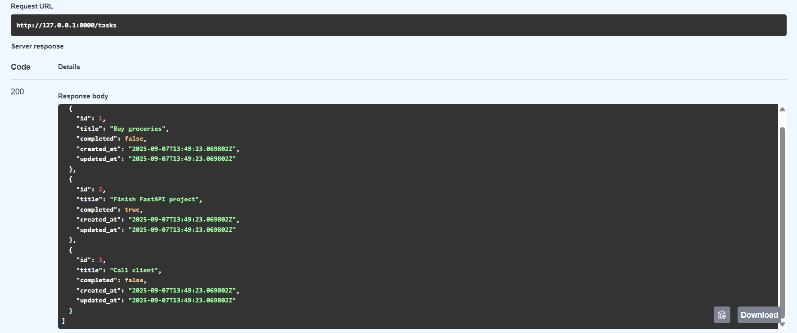
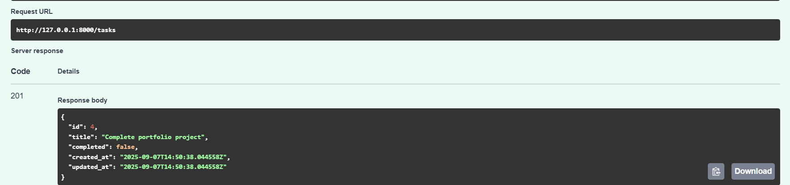
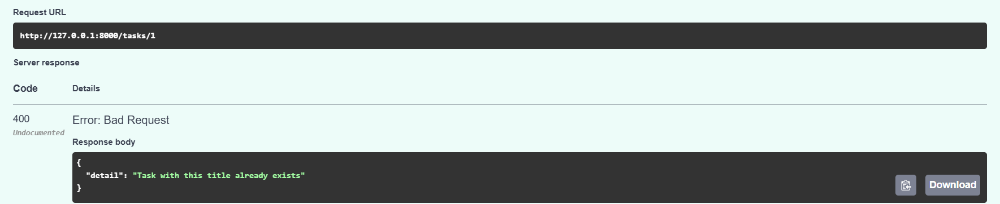
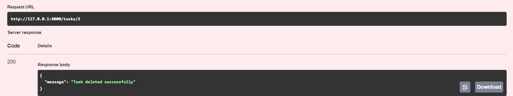
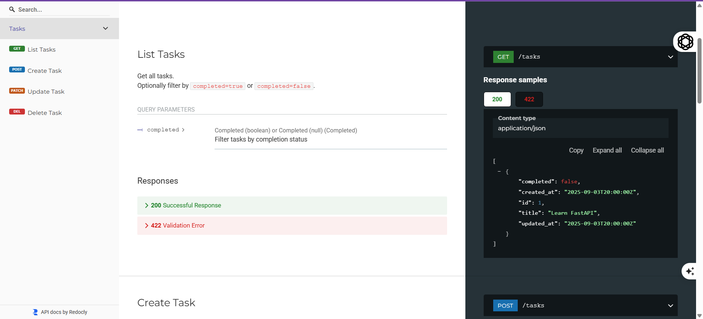

# 🧠 Portfolio Task Manager API

[](https://fastapi.tiangolo.com/)
[](https://www.python.org/)
[](LICENSE)
[](https://github.com/Omer31175/task-manager-api)

A clean and professional task management API built with **FastAPI**, designed to showcase backend skills with validation, timestamps, and interactive documentation. This project is part of a portfolio aimed at recruiters and freelance clients.

---

## 🚀 Features

- ✅ Create, read, update, and delete tasks  
- 🔍 Filter tasks by completion status  
- 🧠 Validation with Pydantic (e.g. non-empty titles)  
- 🕒 Auto-generated timestamps (`created_at`, `updated_at`)  
- 📄 Interactive docs via Swagger and ReDoc  
- 🧪 In-memory storage for demo purposes  

---

## 📸 Screenshots

### 🔍 `GET /tasks` — Lists all tasks with optional filtering  


### 📝 `POST /tasks` — Creates a new task with validation  


### ✏️ `PATCH /tasks/{id}` — Updates task title or completion status  


### 🗑️ `DELETE /tasks/{id}` — Deletes a task by ID  


### 📘 Swagger UI — Interactive API documentation  


### 📗 ReDoc UI — Alternative API documentation view  


---

## 📦 Installation

```bash
# Clone the repo
git clone https://github.com/Omer31175/task-manager-api.git
cd task-manager-api

# Create virtual environment
python -m venv venv
source venv/bin/activate  # On Windows: venv\Scripts\activate

# Install dependencies
pip install -r requirements.txt
🧪 Run the API
Bash


Copy
uvicorn app.main:app --reload
Then open your browser at:

Swagger UI → http://localhost:8000/docs

ReDoc UI → http://localhost:8000/redoc

📬 API Endpoints
GET /tasks
Returns all tasks

Optional query: completed=true or completed=false

POST /tasks
Creates a new task

Title must be unique and non-empty

PATCH /tasks/{id}
Updates an existing task (partial updates allowed)

Title must remain unique

DELETE /tasks/{id}
Deletes a task by ID

📘 Example Payloads
Create Task
Json


Copy
{
  "title": "Complete portfolio project",
  "completed": false
}
Update Task
Json


Copy
{
  "title": "Finish FastAPI project",
  "completed": true
}
🧠 Tech Stack
FastAPI – Web framework

Pydantic – Data validation

Uvicorn – ASGI server

Python 3.11+

🛠️ Project Structure
Code


Copy
task-manager-api/
├── app/
│   └── main.py
├── screenshots/
│   ├── get_tasks.png
│   ├── post_task.png
│   ├── update_task.png
│   ├── delete_task.png
│   ├── swagger.png
│   └── redoc.png
├── requirements.txt
└── README.md
💼 Portfolio Purpose
This project is part of a backend portfolio designed to demonstrate:

Clean API design

Validation and error handling

Visual documentation polish

Recruiter-friendly presentation
